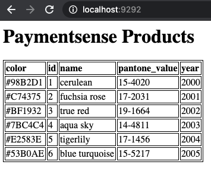

# PS-APP

Ps-app is a simple, straight-forward webserver that queries a list of products, published in JSON format,
and displays them on a webpage.

**Warning: Please run the Cloud Build pipeline in this repository before running `ps-infra`**

## Prerequisites

- Go 1.15
- Helm 3.0+
- Kubernetes 1.16+
- Google Cloud Build (for CI pipeline). 
  The [GitHub plugin](https://github.com/marketplace/google-cloud-build) has been used for development purposes.
  
## Quickstart

### Configure

Please configure the application before running, either by setting the relevant environment variables or setting
the respective helm keys.

| Environment Variable  | Helm Chart Key | Description  | Application default | Helm Chart default | 
|-----------|-----------|--------------------------|---------------------|-----------|
| PRODUCTS_URL | .Values.app.productsUrl | The URL of the Products website | None | `https://reqres.in/api/products/` |
| PORT         | .Values.service.containerPort | The webserver port              | None | `9292` |
| LOG_LEVEL    | .Values.app.logLevel | The logging level      | `debug` | `debug` |

### Test

Unit tests are available for the main http handlers.

`go test -v ./...` will run all the tests in the package.

### Build

`go build -o ps-app .` will produce a runnable binary.
Go 1.12+ (ideally 1.15) is required for Go modules compatibility.

### Package

A Dockerfile is provided, testing and building the code and finally producing a minimal container image.

### Deploy

A Helm chart has been included in the repository to facilitate installation inside a Kubernetes cluster.

#### Cloud Build Pipeline

A cloudbuild pipeline has been provided which automates the first three steps previously described:

1. It builds a minimal Docker image.
1. It tags it with the current `$SHORT_SHA`.
1. It uploads it to GCR.
1. It edits the Helm Chart's appVersion with the current `$SHORT_SHA`.
1. It builds and uploads the Helm chart to GCR.

The application will be deployed by the `ps-infra` terraform script.
Please run this pipeline before running terraform.

## How to use

The application will spin up a webserver, listening on the desired port.

The following paths are available:

| Path | Description |
|------|-------------|
| `/`  | Returns a list of products from `PRODUCTS_URL` and displays them on a webpage |
| `/healthz` | Returns 200 for health probing |

## Preview

